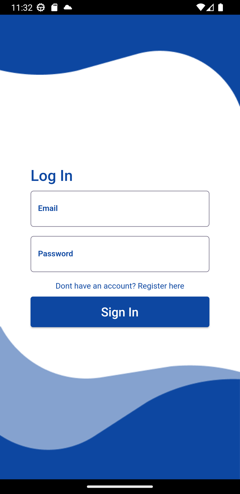
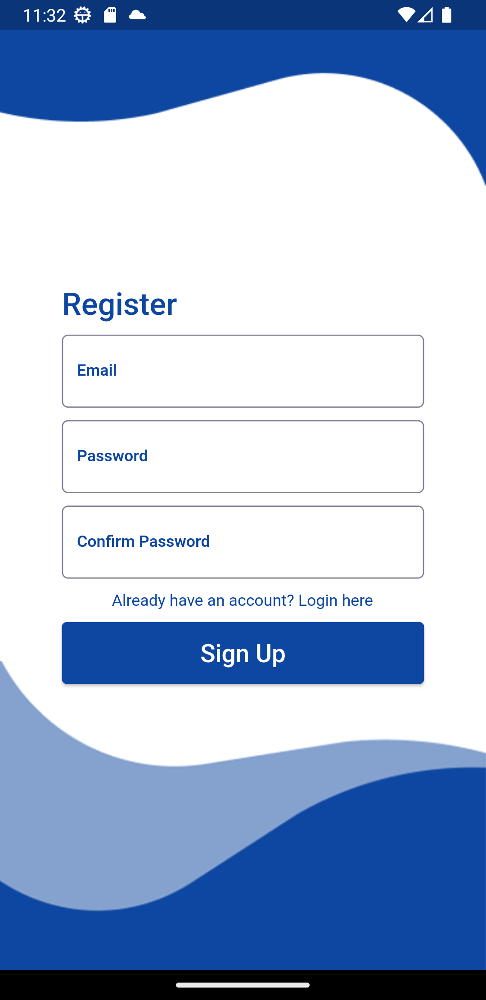
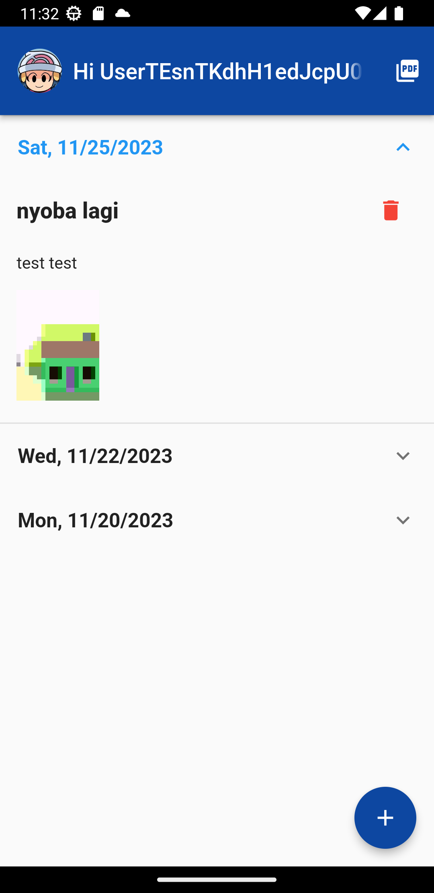
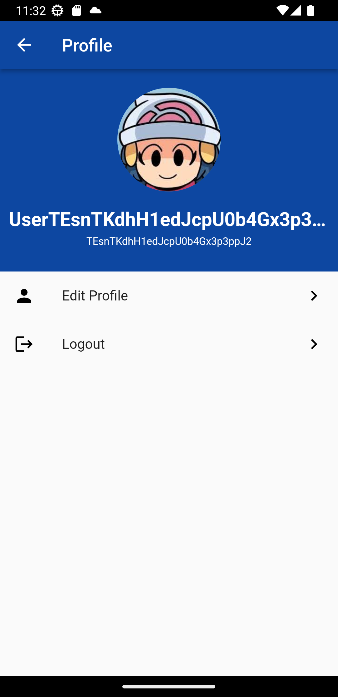
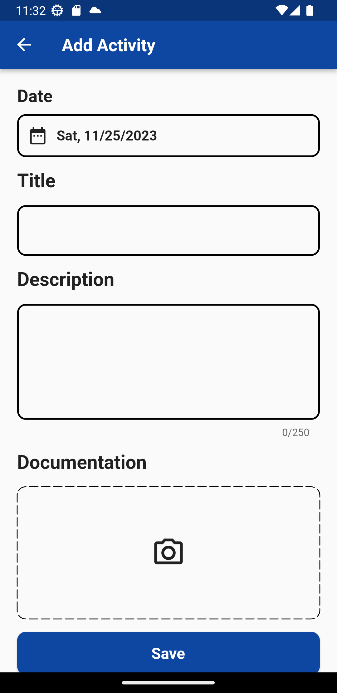

# Flutter Absen Application

## Features

-   Firebase Authentication (Login and Register with email)
-   Create, edit, and Delete Activity (Image store in storage firebase)
-   Edit Profle (Profile Pic and Username)
-   Displaying Activity
-   Export to PDF
-   Responsive UI

## Screenshots

